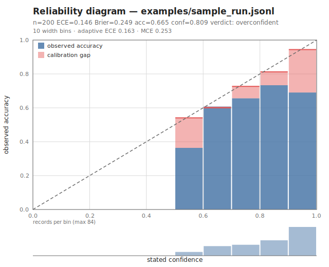
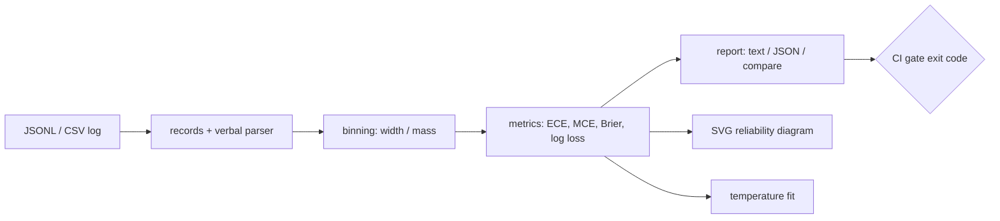

# miscal

[English](README.md) | [中文](README.zh.md) | [日本語](README.ja.md)

[](LICENSE) [](CHANGELOG.md) [](pyproject.toml)  [](CONTRIBUTING.md)

**LLM 分類器のためのオープンソース較正レポートツール——ログに残した確信度から ECE・Brier スコア・共有できる SVG 信頼性ダイアグラムを直接生成、依存ゼロ。**



```bash
git clone https://github.com/JaydenCJ/miscal && cd miscal && pip install -e .
```

> **プレリリース：** miscal はまだ PyPI に公開されていません。最初のリリースまでは [JaydenCJ/miscal](https://github.com/JaydenCJ/miscal) をクローンし、リポジトリのルートで `pip install -e .` を実行してください。

## なぜ miscal？

各チームは確信度を言語化する LLM 分類器——`"92%"`、`"9/10"`、`"very likely"`——を本番投入し、その数字が何かを意味するのか一度も確かめないまま、チケットの振り分け、人間へのエスカレーション、自動承認を任せています。たいてい意味はありません：言語化された確信度は過信で悪名高く、「85% 確実」と言いながら正解率 60% のモデルは、下流のあらゆる閾値を静かに汚染します。これを暴く数学は何十年も前からありますが、既存ツールは ML パイプラインを前提とします：scikit-learn は NumPy 配列を要求し、レポートではなく曲線を返す；netcal や uncertainty-toolbox は、結局ログファイルへの算術にすぎない処理のために SciPy/matplotlib スタックを持ち込みます。miscal はあなたが実際に持っているもの——モデルが書くままの確信度が並ぶ JSONL / CSV の判定ログ——から出発し、コードレビューに貼れるチャートと一行の判定に変えます。コマンド一つ、標準ライブラリのみ、そして `--max-ece` フラグで較正の劣化を本番ではなく CI で赤くします。

|  | miscal | scikit-learn | netcal | uncertainty-toolbox |
|---|---|---|---|---|
| 言語化された確信度の解析（`"92%"`、`"very likely"`） | 対応 | 非対応（float 配列のみ） | 非対応 | 非対応 |
| JSONL/CSV ログを直接読み込み | 対応 | 非対応 | 非対応 | 非対応 |
| 信頼性ダイアグラムの出力 | 単体 SVG | matplotlib 図 | matplotlib 図 | matplotlib 図 |
| 終了コード付き CI ゲート（`--max-ece`） | 対応 | 非対応 | 非対応 | 非対応 |
| ログファイルへの直接の温度スケーリング | 対応 | 配列のみ | 配列のみ | 非対応 |
| ランタイム依存数 | 0 | 4 | 5 | 4 |

<sub>依存数は 2026-07 時点で各パッケージが PyPI に宣言するランタイム依存：scikit-learn 1.7（numpy、scipy、joblib、threadpoolctl）、netcal 1.3.5（numpy、scipy、matplotlib、torch、gpytorch——トップレベルのみ数えて 5）、uncertainty-toolbox 0.1.1（numpy、scipy、matplotlib、tqdm）。miscal の数は [pyproject.toml](pyproject.toml) の `dependencies = []` です。</sub>

## 機能

- **LLM が実際に残すログを読める** —— 確信度は float、`"85%"`、`"9/10"`、0–100 の生の数値、`"very likely"` など 33 のアンカー語のいずれでも可；正誤はブール欄からでも predicted/expected ラベル対からでも導出、フィールド別名を内蔵し `--*-field` で任意のスキーマを上書き。
- **手計算で検証できる完全な指標群** —— ECE、適応型（等質量）ECE、MCE、Murphy の信頼性/分解能/不確実性分解付き Brier スコア、log loss、符号付き確信度ギャップ；全公式が純標準ライブラリ実装で、手計算の参照値テストが固定。
- **共有したくなる信頼性ダイアグラム** —— 決定的な単体 SVG：精度バー、赤い較正ずれオーバーレイ、完全較正の対角線、ビンごとのサンプル数、埋め込みのヘッドライン指標；matplotlib もフォントもネットワークも不要。
- **CI のための較正ゲート** —— `miscal report --max-ece 0.05` はプロンプト変更でモデルが確信度を偽った瞬間に終了コード 1 で落ち、`miscal compare` は 2 つの実行の符号付き差分を表示。
- **1 パラメータの修正も同梱** —— `miscal fit` が決定的な黄金分割探索で NLL 最小の温度を見つけ、スケーリング前後の ECE と log loss を報告し、`--apply` で再投入可能な再較正ログを書き出す。
- **構造からして正直** —— エラーは壊れたレコードの行番号を携え、範囲外の確信度はクランプせず拒否し、データが本当にそうであるときだけ判定に「overconfident」と書く。

## クイックスタート

インストール：

```bash
git clone https://github.com/JaydenCJ/miscal && cd miscal && pip install -e .
```

同梱のサンプルログ（過信ぎみの意図分類器による 200 件の判定——確信度は float・百分率・分数・語が混在）にレポートを実行：

```bash
miscal report examples/sample_run.jsonl
```

実際にキャプチャした出力（空のビンは `...` で省略）：

```text
miscal report — examples/sample_run.jsonl
records: 200   bins: 10 (width)

  accuracy           0.665
  mean confidence    0.809
  confidence gap     +0.144
  ECE                0.146
  adaptive ECE       0.163
  MCE                0.253
  Brier score        0.249
    reliability      0.031
    resolution       0.007
    uncertainty      0.223
  log loss           1.114

  bin        n     conf    acc     gap
  ...
  [0.50,0.60]   11   0.541  0.364  +0.177
  [0.60,0.70]   28   0.600  0.607  -0.007
  [0.70,0.80]   32   0.727  0.656  +0.070
  [0.80,0.90]   45   0.812  0.733  +0.079
  [0.90,1.00]   84   0.944  0.690  +0.253

verdict: overconfident (stated confidence exceeds accuracy by 14.4 points)
```

チャートを描画し（冒頭のヒーロー画像はまさにこのコマンドの出力）、修正をフィッティング：

```bash
miscal diagram examples/sample_run.jsonl -o reliability.svg
miscal fit examples/sample_run.jsonl
```

```text
wrote reliability.svg (200 records, ECE 0.146)
fitted temperature: 5.227
  overconfident (confidences softened toward 0.5)
  log loss  1.1145 -> 0.6615
  ECE       0.1462 -> 0.0889
```

CI にゲートを——終了コード 1 が過信を赤いビルドに変える：

```bash
miscal report examples/sample_run.jsonl --max-ece 0.10   # 終了コード 1：GATE FAIL
miscal report examples/sample_run_v2.jsonl --max-ece 0.10  # プロンプト修正後は終了コード 0
```

## 確信度のフォーマット

| 入力 | 解析結果 | ルール |
|---|---|---|
| `0.85` | 0.85 | `[0, 1]` の数値は確率 |
| `85`、`99.5` | 0.85、0.995 | `(1, 100]` の数値は百分率 |
| `"85%"` | 0.85 | 百分率文字列、範囲 `[0%, 100%]` |
| `"9/10"` | 0.9 | `[0, 1]` に収まる分数 |
| `"very likely"` | 0.90 | アンカー語、大文字小文字を無視 |
| `-0.2`、`150`、`NaN` | エラー | クランプせず拒否——壊れたログは大声で報せるべき |

33 語のアンカー表（`"almost certain"` 0.97、`"likely"` 0.75、`"maybe"` 0.50、`"very unlikely"` 0.08 など）は [`src/miscal/verbal.py`](src/miscal/verbal.py) に；レコードスキーマ・フィールド別名・正誤規則の全容は [`docs/record-format.md`](docs/record-format.md) に記載。

## 指標リファレンス

| 指標 | 範囲 | 読み方 |
|---|---|---|
| ECE | 0–1 | 申告確信度と精度の差の件数加重平均；ヘッドラインの数字 |
| 適応型 ECE | 0–1 | 同上を等質量ビンで——確信度が 1.0 付近に密集するとき信頼できる |
| MCE | 0–1 | 最悪の 1 ビン；ECE が平均で消してしまう局所的な偽りを捕まえる |
| Brier スコア | 0–1 | 確信度と結果の二乗誤差；信頼性 − 分解能 + 不確実性に分解 |
| log loss | 0–∞ | 自信満々の誤りを最も重く罰する；`fit` が最小化する量 |
| 確信度ギャップ | −1–1 | 符号付き `平均確信度 − 精度`；判定の閾値は ±0.02 |

## 検証

このリポジトリは CI を同梱しません；上記の主張はすべてローカル実行で検証されています。このリポジトリのチェックアウトから再現：

```bash
pip install -e '.[dev]' && pytest && bash scripts/smoke.sh
```

出力（実際の実行からコピー、`...` で省略）：

```text
93 passed in 1.99s
...
[gate] exit 1 on ECE 0.146 > 0.10, exit 0 on the fixed run
SMOKE OK
```

## アーキテクチャ



## ロードマップ

- [x] レコード解析、言語化確信度、ECE/MCE/Brier/log-loss、SVG ダイアグラム、温度スケーリング、compare、CI ゲート（v0.1.0）
- [ ] PyPI 公開、`pip install miscal` 対応
- [ ] 多クラス top-k 較正とラベル別の内訳
- [ ] 第二の再較正手法としての等調回帰（isotonic regression）
- [ ] ダイアグラム・表・判定を 1 ファイルにまとめる HTML レポート
- [ ] 生の補完テキストから確信度を抽出するヘルパー

全リストは [open issues](https://github.com/JaydenCJ/miscal/issues) を参照。

## コントリビュート

コントリビュート歓迎——まずは [good first issue](https://github.com/JaydenCJ/miscal/issues?q=is%3Aissue+is%3Aopen+label%3A%22good+first+issue%22) から、あるいは [discussion](https://github.com/JaydenCJ/miscal/discussions) を立ててください。開発環境の構築は [CONTRIBUTING.md](CONTRIBUTING.md) を参照。

## ライセンス

[MIT](LICENSE)
