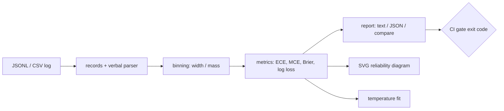

# miscal

[English](README.md) | [中文](README.zh.md) | [日本語](README.ja.md)

[](LICENSE) [](CHANGELOG.md) [](pyproject.toml)  [](CONTRIBUTING.md)

**Open-source calibration reports for LLM classifiers — ECE, Brier, and shareable SVG reliability diagrams straight from your logged confidences, zero dependencies.**


```bash
git clone https://github.com/JaydenCJ/miscal && cd miscal && pip install -e .
```

> **Pre-release:** miscal is not yet published to PyPI. Until the first release, clone [JaydenCJ/miscal](https://github.com/JaydenCJ/miscal) and run `pip install -e .` from the repository root.

## Why miscal?

Teams ship LLM classifiers that verbalize a confidence — `"92%"`, `"9/10"`, `"very likely"` — then route tickets, escalate to humans, or auto-approve based on that number without ever checking whether it means anything. Usually it does not: verbalized confidences are notoriously overconfident, and an "85% sure" model that is right 60% of the time silently poisons every downstream threshold. The math to expose this has existed for decades, but the tooling assumes an ML pipeline: scikit-learn wants NumPy arrays and gives you a curve, not a report; netcal and uncertainty-toolbox pull in the SciPy/matplotlib stack for what is ultimately arithmetic on a log file. miscal starts from what you actually have — a JSONL or CSV of logged decisions, confidences written the way models write them — and turns it into the chart and the one-line verdict you can paste into a code review. One command, standard library only, and a `--max-ece` flag so calibration regressions fail CI instead of reaching production.

|  | miscal | scikit-learn | netcal | uncertainty-toolbox |
|---|---|---|---|---|
| Parses verbalized confidences (`"92%"`, `"very likely"`) | Yes | No (float arrays) | No | No |
| Reads JSONL/CSV logs directly | Yes | No | No | No |
| Reliability diagram output | standalone SVG | matplotlib figure | matplotlib figure | matplotlib figure |
| CI gate with exit codes (`--max-ece`) | Yes | No | No | No |
| Temperature scaling from a log file | Yes | on arrays | on arrays | No |
| Runtime dependencies | 0 | 4 | 5 | 4 |

<sub>Dependency counts are the declared runtime requirements on PyPI as of 2026-07: scikit-learn 1.7 (numpy, scipy, joblib, threadpoolctl), netcal 1.3.5 (numpy, scipy, matplotlib, torch, gpytorch — 5 counting only top-level), uncertainty-toolbox 0.1.1 (numpy, scipy, matplotlib, tqdm). miscal's count is `dependencies = []` in [pyproject.toml](pyproject.toml).</sub>

## Features

- **Reads what LLMs actually log** — confidences as floats, `"85%"`, `"9/10"`, bare 0–100 numbers, or 33 anchor words like `"very likely"`; correctness from a boolean field or a predicted/expected label pair, with field aliases and `--*-field` overrides for any schema.
- **The full metric set, hand-checkable** — ECE, adaptive (equal-mass) ECE, MCE, Brier score with the Murphy reliability/resolution/uncertainty decomposition, log loss, and a signed confidence gap; every formula is pure stdlib and pinned by hand-computed reference tests.
- **Reliability diagrams worth sharing** — deterministic standalone SVG with accuracy bars, red miscalibration overlays, the perfect-calibration diagonal, per-bin sample counts, and the headline numbers baked in; no matplotlib, no fonts, no network.
- **Calibration gates for CI** — `miscal report --max-ece 0.05` exits 1 the moment a prompt change makes the model lie about its confidence, and `miscal compare` prints signed deltas between two runs.
- **A one-parameter fix included** — `miscal fit` finds the NLL-minimizing temperature by deterministic golden-section search, reports before/after ECE and log loss, and `--apply` writes a recalibrated log you can feed back in.
- **Honest by construction** — errors carry the line number of the broken record, out-of-range confidences are rejected rather than clamped, and the verdict says "overconfident" only when the data does.

## Quickstart

Install:

```bash
git clone https://github.com/JaydenCJ/miscal && cd miscal && pip install -e .
```

Run a report on the bundled example log (200 decisions from an overconfident intent classifier — confidences logged as floats, percentages, fractions, and words):

```bash
miscal report examples/sample_run.jsonl
```

Real captured output (empty bins elided with `...`):

```text
miscal report — examples/sample_run.jsonl
records: 200   bins: 10 (width)

  accuracy           0.665
  mean confidence    0.809
  confidence gap     +0.144
  ECE                0.146
  adaptive ECE       0.163
  MCE                0.253
  Brier score        0.249
    reliability      0.031
    resolution       0.007
    uncertainty      0.223
  log loss           1.114

  bin        n     conf    acc     gap
  ...
  [0.50,0.60]   11   0.541  0.364  +0.177
  [0.60,0.70]   28   0.600  0.607  -0.007
  [0.70,0.80]   32   0.727  0.656  +0.070
  [0.80,0.90]   45   0.812  0.733  +0.079
  [0.90,1.00]   84   0.944  0.690  +0.253

verdict: overconfident (stated confidence exceeds accuracy by 14.4 points)
```

Render the chart (the hero image above is this exact command's output) and fit the fix:

```bash
miscal diagram examples/sample_run.jsonl -o reliability.svg
miscal fit examples/sample_run.jsonl
```

```text
wrote reliability.svg (200 records, ECE 0.146)
fitted temperature: 5.227
  overconfident (confidences softened toward 0.5)
  log loss  1.1145 -> 0.6615
  ECE       0.1462 -> 0.0889
```

Gate CI on it — exit code 1 turns overconfidence into a red build:

```bash
miscal report examples/sample_run.jsonl --max-ece 0.10   # exits 1: GATE FAIL
miscal report examples/sample_run_v2.jsonl --max-ece 0.10  # exits 0 after the prompt fix
```

## Confidence formats

| Input | Parsed as | Rule |
|---|---|---|
| `0.85` | 0.85 | numbers in `[0, 1]` are probabilities |
| `85`, `99.5` | 0.85, 0.995 | numbers in `(1, 100]` are percentages |
| `"85%"` | 0.85 | percent strings, `[0%, 100%]` |
| `"9/10"` | 0.9 | fractions in `[0, 1]` |
| `"very likely"` | 0.90 | anchor words, case-insensitive |
| `-0.2`, `150`, `NaN` | error | rejected, never clamped — a bad log should be loud |

The 33-word anchor scale (`"almost certain"` 0.97, `"likely"` 0.75, `"maybe"` 0.50, `"very unlikely"` 0.08, …) lives in [`src/miscal/verbal.py`](src/miscal/verbal.py); the full record schema, field aliases, and correctness rules are documented in [`docs/record-format.md`](docs/record-format.md).

## Metrics reference

| Metric | Range | Reading it |
|---|---|---|
| ECE | 0–1 | count-weighted mean gap between stated confidence and accuracy; the headline number |
| adaptive ECE | 0–1 | same, on equal-mass bins — trustworthy when confidences cluster near 1.0 |
| MCE | 0–1 | the single worst bin; catches localized lying that ECE averages away |
| Brier score | 0–1 | squared error of confidence vs outcome; decomposed into reliability − resolution + uncertainty |
| log loss | 0–∞ | punishes confident misses hardest; the quantity `fit` minimizes |
| confidence gap | −1–1 | signed `mean confidence − accuracy`; the verdict threshold is ±0.02 |

## Verification

This repository ships no CI; every claim above is verified by local runs. Reproduce them from a checkout of this repository:

```bash
pip install -e '.[dev]' && pytest && bash scripts/smoke.sh
```

Output (copied from a real run, truncated with `...`):

```text
93 passed in 1.99s
...
[gate] exit 1 on ECE 0.146 > 0.10, exit 0 on the fixed run
SMOKE OK
```

## Architecture



## Roadmap

- [x] Record parsing, verbalized confidences, ECE/MCE/Brier/log-loss, SVG diagrams, temperature scaling, compare, CI gates (v0.1.0)
- [ ] PyPI release with `pip install miscal`
- [ ] Multi-class top-k calibration and per-label breakdown
- [ ] Isotonic regression as a second recalibration method
- [ ] HTML report bundling diagram, table, and verdict in one file
- [ ] Confidence extraction helpers for raw completion text

See the [open issues](https://github.com/JaydenCJ/miscal/issues) for the full list.

## Contributing

Contributions are welcome — start with a [good first issue](https://github.com/JaydenCJ/miscal/issues?q=is%3Aissue+is%3Aopen+label%3A%22good+first+issue%22) or open a [discussion](https://github.com/JaydenCJ/miscal/discussions). See [CONTRIBUTING.md](CONTRIBUTING.md) for the development setup.

## License

[MIT](LICENSE)
