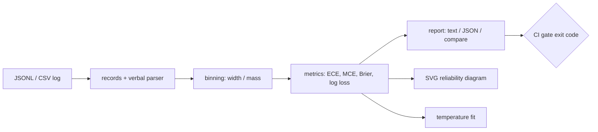

# miscal

[English](README.md) | [中文](README.zh.md) | [日本語](README.ja.md)

[](LICENSE) [](CHANGELOG.md) [](pyproject.toml)  [](CONTRIBUTING.md)

**开源的 LLM 分类器校准报告工具——直接从记录的置信度日志生成 ECE、Brier 分数和可分享的 SVG 可靠性图，零依赖。**


```bash
git clone https://github.com/JaydenCJ/miscal && cd miscal && pip install -e .
```

> **预发布：** miscal 尚未发布到 PyPI。在首个正式版本之前，请克隆 [JaydenCJ/miscal](https://github.com/JaydenCJ/miscal) 并在仓库根目录运行 `pip install -e .`。

## 为什么选择 miscal？

各团队上线的 LLM 分类器会口头给出置信度——`"92%"`、`"9/10"`、`"very likely"`——然后就依据这个数字来分派工单、升级人工、自动审批，却从不检查它是否有任何意义。通常它没有：口头置信度以过度自信著称，一个自称"85% 确定"却只有 60% 正确率的模型，会悄悄毒化下游的每一个阈值。揭露这一点的数学方法已经存在几十年，但现有工具都假设你有一条 ML 流水线：scikit-learn 要 NumPy 数组，给你的是曲线而不是报告；netcal 和 uncertainty-toolbox 为了本质上只是对日志文件做算术的事，拖进整个 SciPy/matplotlib 技术栈。miscal 从你实际拥有的东西出发——一份 JSONL 或 CSV 的决策日志、以模型的书写方式记录的置信度——把它变成能贴进 code review 的图表和一行结论。一条命令，纯标准库，外加一个 `--max-ece` 开关，让校准回归在 CI 里挂红灯而不是流入生产。

|  | miscal | scikit-learn | netcal | uncertainty-toolbox |
|---|---|---|---|---|
| 解析口头置信度（`"92%"`、`"very likely"`） | 支持 | 不支持（仅浮点数组） | 不支持 | 不支持 |
| 直接读取 JSONL/CSV 日志 | 支持 | 不支持 | 不支持 | 不支持 |
| 可靠性图输出 | 独立 SVG | matplotlib 图 | matplotlib 图 | matplotlib 图 |
| 带退出码的 CI 门禁（`--max-ece`） | 支持 | 不支持 | 不支持 | 不支持 |
| 直接对日志文件做温度缩放 | 支持 | 仅对数组 | 仅对数组 | 不支持 |
| 运行时依赖数 | 0 | 4 | 5 | 4 |

<sub>依赖数为 2026-07 时各包在 PyPI 上声明的运行时依赖：scikit-learn 1.7（numpy、scipy、joblib、threadpoolctl），netcal 1.3.5（numpy、scipy、matplotlib、torch、gpytorch——只计顶层为 5），uncertainty-toolbox 0.1.1（numpy、scipy、matplotlib、tqdm）。miscal 的依赖数即 [pyproject.toml](pyproject.toml) 中的 `dependencies = []`。</sub>

## 功能特性

- **读得懂 LLM 真实的日志** —— 置信度可以是浮点数、`"85%"`、`"9/10"`、0–100 的裸数字，或 `"very likely"` 等 33 个锚定词；正误可以来自布尔字段，也可以由 predicted/expected 标签对推导，内置字段别名并支持 `--*-field` 覆盖任意 schema。
- **完整且可手算校验的指标集** —— ECE、自适应（等质量）ECE、MCE、带 Murphy 可靠性/分辨率/不确定性分解的 Brier 分数、log loss、带符号的置信度差；每个公式都是纯标准库实现，并由手工推算的参考值测试钉死。
- **值得分享的可靠性图** —— 确定性的独立 SVG：准确率柱、红色失准覆盖层、完美校准对角线、每个 bin 的样本数、内嵌的关键指标；不需要 matplotlib、字体或网络。
- **面向 CI 的校准门禁** —— `miscal report --max-ece 0.05` 会在提示词改动让模型谎报置信度的那一刻以退出码 1 失败，`miscal compare` 打印两次运行之间的带符号差值。
- **附带单参数修复方案** —— `miscal fit` 用确定性黄金分割搜索找到最小化 NLL 的温度，报告缩放前后的 ECE 和 log loss，`--apply` 写出可回喂的重校准日志。
- **构造上的诚实** —— 报错携带出错记录的行号，越界置信度直接拒绝而不是截断，只有数据真的支持时结论才会写"overconfident"。

## 快速上手

安装：

```bash
git clone https://github.com/JaydenCJ/miscal && cd miscal && pip install -e .
```

对随附的示例日志运行报告（一个过度自信的意图分类器的 200 条决策——置信度以浮点、百分比、分数和词语混合记录）：

```bash
miscal report examples/sample_run.jsonl
```

真实捕获的输出（空 bin 用 `...` 省略）：

```text
miscal report — examples/sample_run.jsonl
records: 200   bins: 10 (width)

  accuracy           0.665
  mean confidence    0.809
  confidence gap     +0.144
  ECE                0.146
  adaptive ECE       0.163
  MCE                0.253
  Brier score        0.249
    reliability      0.031
    resolution       0.007
    uncertainty      0.223
  log loss           1.114

  bin        n     conf    acc     gap
  ...
  [0.50,0.60]   11   0.541  0.364  +0.177
  [0.60,0.70]   28   0.600  0.607  -0.007
  [0.70,0.80]   32   0.727  0.656  +0.070
  [0.80,0.90]   45   0.812  0.733  +0.079
  [0.90,1.00]   84   0.944  0.690  +0.253

verdict: overconfident (stated confidence exceeds accuracy by 14.4 points)
```

渲染图表（上方 hero 图正是这条命令的输出）并拟合修复：

```bash
miscal diagram examples/sample_run.jsonl -o reliability.svg
miscal fit examples/sample_run.jsonl
```

```text
wrote reliability.svg (200 records, ECE 0.146)
fitted temperature: 5.227
  overconfident (confidences softened toward 0.5)
  log loss  1.1145 -> 0.6615
  ECE       0.1462 -> 0.0889
```

在 CI 上设门禁——退出码 1 把过度自信变成红色构建：

```bash
miscal report examples/sample_run.jsonl --max-ece 0.10   # 退出码 1：GATE FAIL
miscal report examples/sample_run_v2.jsonl --max-ece 0.10  # 提示词修复后退出码 0
```

## 置信度格式

| 输入 | 解析结果 | 规则 |
|---|---|---|
| `0.85` | 0.85 | `[0, 1]` 内的数字是概率 |
| `85`、`99.5` | 0.85、0.995 | `(1, 100]` 内的数字是百分比 |
| `"85%"` | 0.85 | 百分比字符串，范围 `[0%, 100%]` |
| `"9/10"` | 0.9 | `[0, 1]` 内的分数 |
| `"very likely"` | 0.90 | 锚定词，不区分大小写 |
| `-0.2`、`150`、`NaN` | 报错 | 拒绝而非截断——坏日志就该响亮地报错 |

33 个词的锚定表（`"almost certain"` 0.97、`"likely"` 0.75、`"maybe"` 0.50、`"very unlikely"` 0.08……）位于 [`src/miscal/verbal.py`](src/miscal/verbal.py)；完整的记录 schema、字段别名和正误规则见 [`docs/record-format.md`](docs/record-format.md)。

## 指标参考

| 指标 | 范围 | 怎么读 |
|---|---|---|
| ECE | 0–1 | 声称置信度与准确率之差的按样本数加权平均；头号指标 |
| 自适应 ECE | 0–1 | 同上，但用等质量 bin——当置信度扎堆在 1.0 附近时更可信 |
| MCE | 0–1 | 最差的那个 bin；抓出被 ECE 平均掉的局部谎报 |
| Brier 分数 | 0–1 | 置信度对结果的平方误差；分解为可靠性 − 分辨率 + 不确定性 |
| log loss | 0–∞ | 对高置信度错误惩罚最重；`fit` 最小化的正是它 |
| 置信度差 | −1–1 | 带符号的 `平均置信度 − 准确率`；结论阈值为 ±0.02 |

## 验证

本仓库不附带 CI；以上每一条主张都由本地运行验证。从本仓库的检出中复现：

```bash
pip install -e '.[dev]' && pytest && bash scripts/smoke.sh
```

输出（复制自真实运行，用 `...` 截断）：

```text
93 passed in 1.99s
...
[gate] exit 1 on ECE 0.146 > 0.10, exit 0 on the fixed run
SMOKE OK
```

## 架构



## 路线图

- [x] 记录解析、口头置信度、ECE/MCE/Brier/log-loss、SVG 图表、温度缩放、compare、CI 门禁（v0.1.0）
- [ ] 发布到 PyPI，支持 `pip install miscal`
- [ ] 多分类 top-k 校准与按标签细分
- [ ] 等张回归作为第二种重校准方法
- [ ] 把图表、表格和结论打包为单文件 HTML 报告
- [ ] 从原始补全文本提取置信度的辅助工具

完整列表见 [open issues](https://github.com/JaydenCJ/miscal/issues)。

## 参与贡献

欢迎贡献——从一个 [good first issue](https://github.com/JaydenCJ/miscal/issues?q=is%3Aissue+is%3Aopen+label%3A%22good+first+issue%22) 开始，或发起一个 [discussion](https://github.com/JaydenCJ/miscal/discussions)。开发环境搭建见 [CONTRIBUTING.md](CONTRIBUTING.md)。

## 许可证

[MIT](LICENSE)
